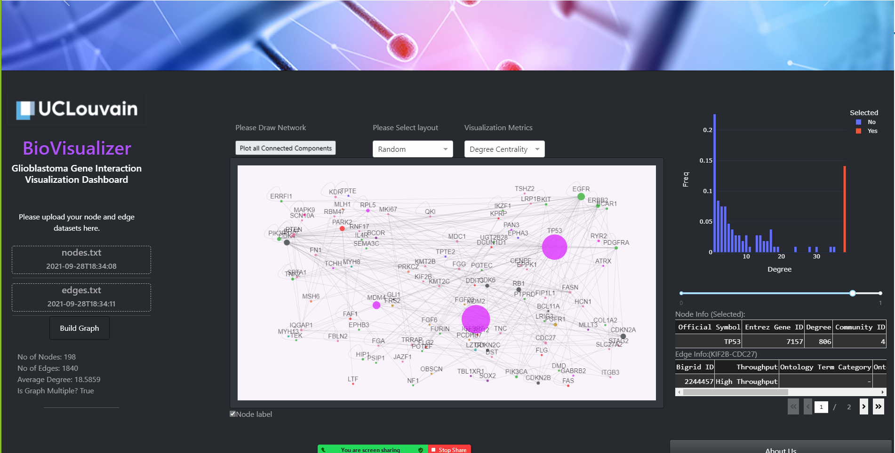

# BioVisualizer

In the modern era when data exist everywhere, Information visualization is considered as an important analytical tool to display and process data for different aspects and it is quickly being recognized as an essential part of effective research communication.

## Problem domain

In this project for 'Data Visualization' course taught by [Prof. John A. Lee](https://scholar.google.com/citations?user=ZopTupcAAAAJ&hl=en)
at [UClouvain](https://uclouvain.be), we were asked to provide an
Information visualization dashboard to visualize a glioblastoma gene interaction dataset that includes both edges and nodes dataset separately. Furthermore, this interactional dashboard should have been designed so that it can satisfy user's needs such as:

- uploading new datasets with a specific format

- modifying the color and size of the nodes and edges according to some metrics

- depicting multiple views of the graph structure

## Our response

In order to achieve this goal, we developed a user-friendly dashboard (called **BioVisualizer**) with Python 3 and [Dash](https://dash.plotly.com/introduction)
framework for building GUI. Dash is a powerful framework built specially for creating interactive data visualization apps. In order to create a Network visualization app using Dash, we utilized Dash Cytoscape, which is a network visualization component for
Dash. Moreover, as we required to apply some network algorithms such as Community Detection, Shortest-path, we used python NetworkX library. This Dashbord was designed by [Nima Farnoodian](mailto:nima.farnoodian@student.uclouvain.be)
and [Atefeh Bahrami](mailto:atefeh.bahrami@student.uclouvain.be)
at EPL, Université catholique de Louvain, December 2021.

## Demo
### [Deployment](https://nimafarnoodian.pythonanywhere.com/)

### [Tutorial](./files/report-tutorial.pdf) 

